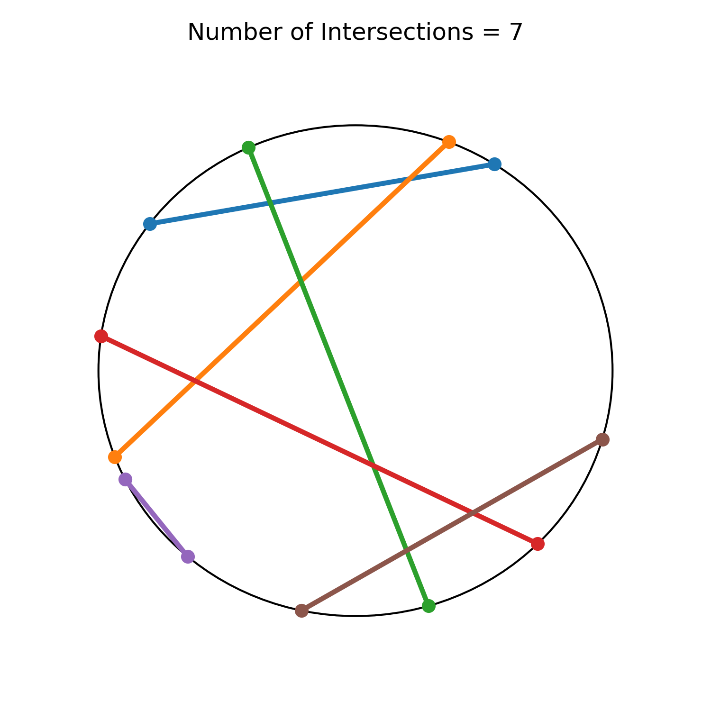

# Structify Take-Home Question
### Problem Statement

Given a set of chords, we want to calculate how many intersections between these chords has happened inside the circle.

##### Assumption #1: All given points are unique.
##### Assumption #2: The given list of radians is already sorted ascending.

### How to use the code:
In `main.py`, enter your sorted set of endpoints for the chords. For example:

    input_list = [[0.78, 1.47, 1.77, 3.92], ['s1', 's2', 'e1', 'e2']]

If you want the code to generate a visualization, set `draw=True`, and in order to save the image on the directory, set `save=True`. Otherwise, the result will be also printed in the terminal.

Visualization example:

### Algorithm:
First Create two lists (`seen` as all-False and `ends` as all-None elements) of length `n` (number of points in the input list). Create an empty list `opens`.

Iterate through the given points in the order given, which is ordered by ascending order of the radian values:

1) If the index `i` (so index of `s1` is `1`, index of `e5` is `5` and so on) of the point has not been already seen (it is not in the `opens` list) then set the `seen[i]=True`, save the endpoint radian in `ends[i]` and add it to the `opens`, so we know that the "bracket" of this chord is open.

2) If the index `i` of the point has already been seen and it is present in the `opens` list, then first remove it from `opens` (so closing the bracket), then count the number of open chords in `opens` with endpoints after the endpoint of chord `i` (which is `ends[i]`). Because the given list of radians is sorted, we can do this in `log(n)` time complexity using the bisection method to find the number of elements in `opens` which are larger than `ends[i]`. Otherwise we would have been forced to do brute-force searching (`O(n^2)`) or implementing a more complex data structure such as range query data structures (`O(log(n))`).

Since we do this `n` times, the running time of the overall algorithm will be `O(n log(n))`.

### Tests:
Some test cases are provided in the `tests.py` file. These will test the output of the algorithm for some parametric known cases (such as no intersections, all chords being diameters, and the examples given in the problem description).